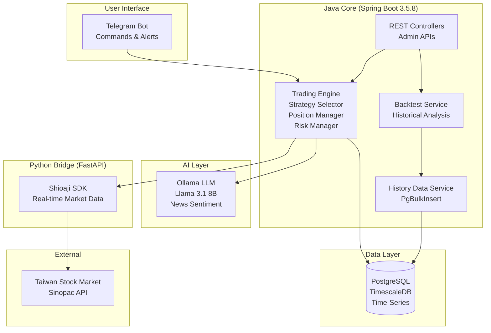

[](https://github.com/DreamFulFil/Automatic-Equity-Trader/actions/workflows/ci.yml)

# Automatic Equity Trader

**Version 0.79.0** - Semantic Versioning Release

[](LICENSE)
[](https://openjdk.org/)
[](https://python.org/)
[](https://ollama.ai/)
[](tests/)

---

## 🎯 TL;DR

**Automatic Equity Trader** is a risk-first, AI-powered automated trading platform for Taiwan stock market. Designed for capital preservation with conservative strategies, comprehensive testing, and full observability.

**Production-Ready:** 524 passing tests | 99 strategies | AI trade veto

---

## 🏗️ Architecture



**Key Components:**
- **Java Core:** Spring Boot 3.5.8, Trading Engine, Strategy Framework
- **Python Bridge:** FastAPI, Shioaji SDK for real-time Taiwan market data
- **AI Layer:** Ollama (Llama 3.1 8B) for news sentiment and trade validation
- **Database:** PostgreSQL with TimescaleDB for time-series optimization
- **Monitoring:** Telegram bot for real-time alerts and control

---

## 🚀 Quickstart

### Prerequisites
- Java 21+ (via jenv)
- Python 3.12+
- PostgreSQL 15+
- Ollama (for AI features)
- Sinopac account (for Taiwan market access)

### Installation

```bash
# 1. Clone repository
git clone https://github.com/DreamFulFil/Automatic-Equity-Trader.git
cd Automatic-Equity-Trader

# 2. Setup Python environment
python3 -m venv venv
source venv/bin/activate
pip install -r python/requirements.txt

# 3. Configure secrets (Jasypt encrypted)
# Edit src/main/resources/application-secret.properties
# Encrypt sensitive values: mvn jasypt:encrypt-value -Djasypt.encryptor.password=YOUR_PASSWORD

# 4. Run tests (requires Jasypt password)
./run-tests.sh YOUR_JASYPT_PASSWORD

# 5. Start application
./start-auto-trader.fish YOUR_JASYPT_PASSWORD
```

---

## 📱 Telegram Commands

Control the trading bot via Telegram. See [Telegram Commands Documentation](docs/usage/telegram-commands.md) for full reference.

**Quick Reference:**
- `/status` - View positions and P&L
- `/pause` / `/resume` - Control trading
- `/golive` → `/confirm_live` - Switch to live mode
- `/help` - List all commands

---

## 🧪 Testing

```bash
# Unit tests only (fast)
./run-tests.sh --unit YOUR_JASYPT_PASSWORD

# Full test suite (unit + integration + e2e)
./run-tests.sh YOUR_JASYPT_PASSWORD
```

**Test Coverage:**
- **Java:** 371 unit tests + 25 integration tests + 16 e2e tests
- **Python:** 96 unit tests + integration tests
- **Total:** 524 tests, all passing

---

## 📊 Version History

**Current Version:** `0.79.0` (from [VERSION](VERSION) file)

This project follows [Semantic Versioning](https://semver.org/):
- **Minor versions** (0.X.0): New features, performance improvements, refactoring
- **Patch versions** (0.X.Y): Bug fixes, maintenance, documentation, CI/CD

**Recent Releases:**
- `v0.79.0` - PgBulkInsert and single-writer pattern for data ingestion
- `v0.77.0` - JDBC batch insert optimization
- `v0.76.0` - PostgreSQL COPY protocol for bulk inserts

**All Releases:** See [git tags](https://github.com/DreamFulFil/Automatic-Equity-Trader/tags) for complete version history.

---

## 📚 Documentation

- **[Telegram Commands](docs/usage/telegram-commands.md)** - Bot command reference
- **[Contributing Guidelines](.github/copilot-instructions.md)** - Development standards
- **[Test Suite](run-tests.sh)** - Testing framework

---

## ⚖️ License

[MIT License](LICENSE) - Use at your own risk. Not financial advice.

---

## 🛡️ Risk Disclaimer

This software is for **educational purposes only**. Trading involves substantial risk of loss. Past performance does not guarantee future results. Always test in simulation mode before deploying capital.

**Conservative by Design:**
- 80,000 TWD starting capital (small account size)
- Stop-loss on every trade
- AI veto layer for risk mitigation
- Earnings blackout periods
- Position sizing limits

**You are responsible for your own trading decisions.**
